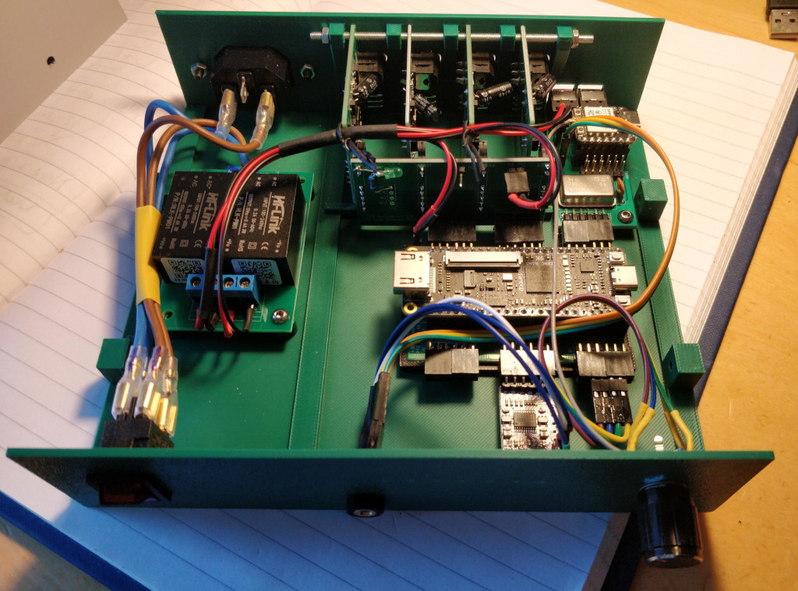
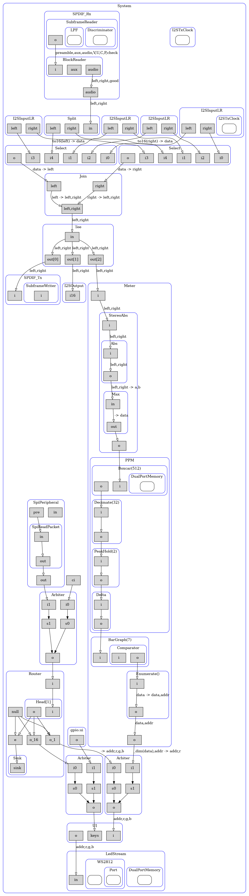
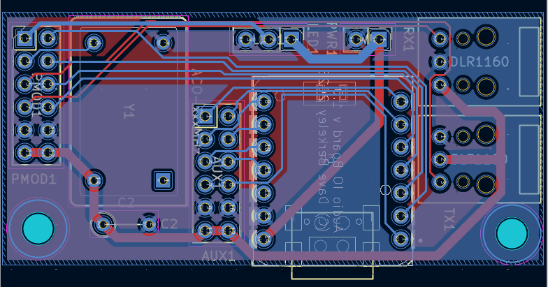
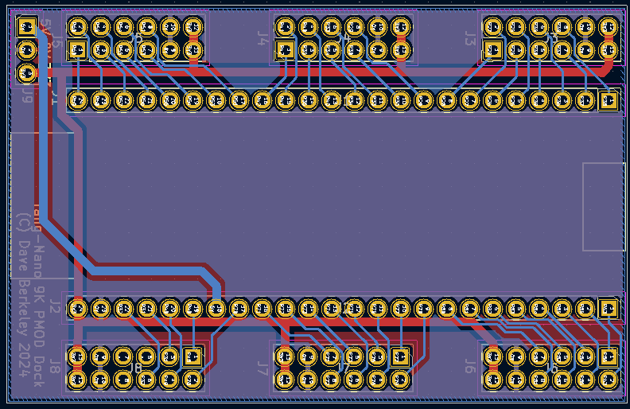
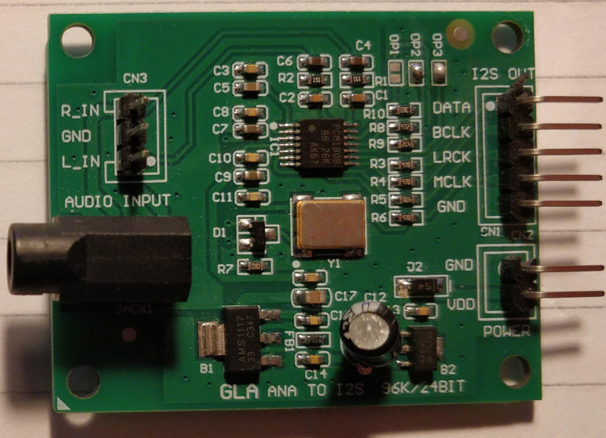
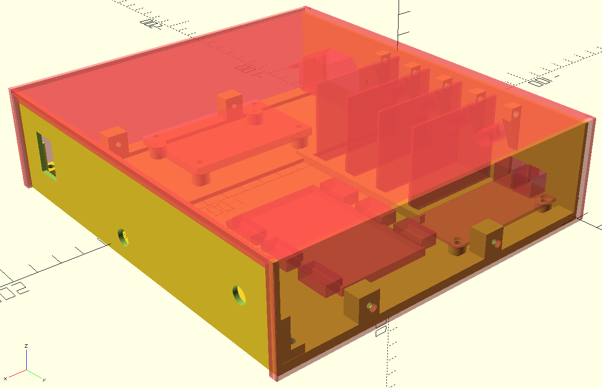
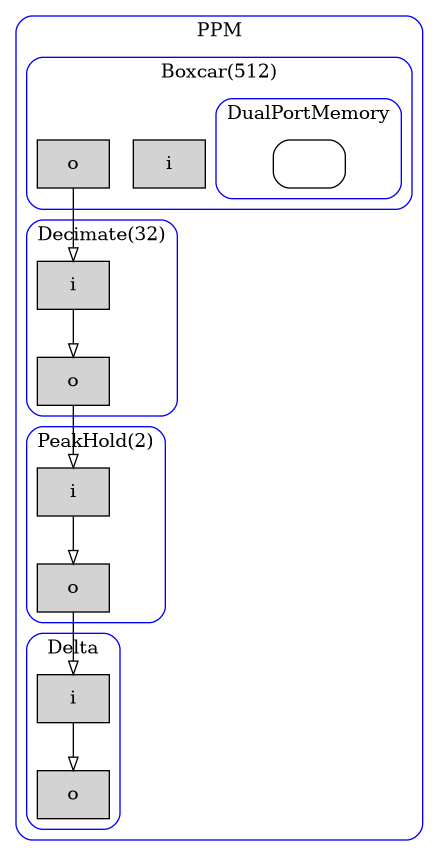

Digital Audio Switcher
====

FPGA based digital audio switcher.

I've started a number of digital audio projects, all more complex than this one.
They are all still in the "pending" file. I hope to return to them.

I'd already built all the gateware elements to do [I2S][I2S] and [SPDIF][SPDIF] io.
I had a [TangNano9k][TangNano9k] FPGA board that I wanted to try out.
I'd bought several I2S ADC boards for another project.
I wanted to make something fairly simple and straightforward.
So I built a digital audio switcher. 
It takes 4 analog stereo channels in, selects one of them and outputs [SPDIF][SPDIF] over an optical [TOSLINK][TOSLINK] output.
It can also do a simple "loop through", selecting an SPDIF input to be the output.

I use my [Streams][Streams] library, an [Amaranth][Amaranth] gateware library for connecting FPGA processing blocks.

The Streams library can generate DOT images showing how the blocks are connected.
This is the output graph.

Most of the blocks are taken from the Streams library. 
It has all the code needed to create I2S i/o, SPDIF i/o, SPI etc.
There are also modules to connect blocks, eg. 
Split (divide a payload into more than one output Stream), 
Join (connect 2 or more Streams together), 
Arbiter (pass packets from multiple sources to a single output)
and Router (select an output Stream based on the first data element in a packet).
These building blocks can be used to connect modules together to build systems.

The Optical  / debug / timing board
====

Kicad files available on [GitHub](https://github.com/DaveBerkeley/audio_switch_io)

This board has a PMOD connector, an oscillator, an ESP32 and two TOSLINK adaptors.

The timing is generated from a 49.152MHz crystal oscillator.
I like the common abbreviation for crystal : 'xtal'. 
The use of X - or more properly the Greek letter Chi - dates back to early medieval times,
where monks would use the letter Chi as an abreviation for the name of Christ.
So Christmas would be written Xmas, Christopher as Xopher etc.
It is a little anachronistic to have this mediaval shorthand used in modern technology.

The audio streams all run at 48kHz (Fs). The audio data is all 16-bits wide.
The 49.152MHz timing source was chosen as it can be used to derive all the other timing signals. 
It is 48kHz * 1024.
The 49.152MHz clock is used as the main system clock for the FPGA.
The I2S inputs use MCK = 24.576MHz (Fs * 512), SCK = 3.072MHz (Fs * 64) etc.
The TangNano has an on-board 27MHz xtal, but the PLL can't generate an exact 48kHz multiple
from this, so I added my own external source.
I don't have any surface mount facilities or skills, so I had to use a through-hole device.
The only one I could find is a 14-pin DIP package, the size of a bus.

Build times for the whole Amaranth / LiteX system can be quite long, 
so I tend to use a shortcut to speed the development cycle. 
Instead of using a DMA channel from the RISC-V I connect an external SPI 
interface and attach an ESP32 processor. I use this for all my FPGA projects.
A SPI input going to a Router block that passes packets to control the FPGA 
is a simple way of configuring the FPGA run-time behaviour.

So, for deveopment, I added a 
[XIAO-ESP32-C3](https://wiki.seeedstudio.com/XIAO_ESP32C3_Getting_Started/)
from Seeed Studio.
The ESP32 isn't needed for normal operation so doesn't have to be fitted.

The board also has a pair of TOSLINK Rx / Tx connectors. 
These allow you to connect fibre optic cables to the FPGA.

Tang Nano 9k Dock
====

I made this board a while ago. It provides 6 PMOD connectors as a break-out board for the 
[TangNano9k][TangNano9k] FPGA board.

Kicad layout on [GitHub](https://github.com/DaveBerkeley/tang_nano_dock)

I'm still using the v1.0 PCB which has a defect on it. 
One of the i/o banks (J6) is powered at 1V8, the rest are 3V3.
I missed this vital fact and one of the 1V8 io lines appears
on a PMOD with 7 other 3V3 io lines (J7).

I haven't made any of the v1.1 PCBs, so the code currently expects the v1.0 version.
I need to alter the gateware to work with either, as the PMOD pins will need to 
be remapped slightly. I also need to add some mounting holes under the Sipeed board.

I2S / PMOD backplane
====

This is a simple connector board. 
It connects up to 4 I2S ADC boards to a single PMOD connector.

Kicad layout on [GitHub](https://github.com/DaveBerkeley/i2s_bus_io)

The ADCs I bought from AliExpress
[AliExpress](https://www.aliexpress.com/item/1005007149044734.html).
They have a PCM1808 onboard and a 3.5mm stereo audio jack.

The card has to be set so it can sync to incoming signals (short op2 and op3). 
They can also generate the timing and have an oscillator on board that I'm not using.

PSU Board
====

I made a simple PCB with a pair of 5V switch mode power supply modules and some connectors.
This board was a bit of a disaster and I need to redesign it.
The connectors have the wrong footprint.
I need to respin this.

The mains power comes in through a panel mounting IEC connector on the rear panel
and is switched by a switch on the front panel.

There are two 5V supplies, one for the digital logic (FPGA, ESP32, LEDs)
the other for the analog circuits 
(the ADC boards also have their own regulators on each board).

The Case
====

CAD code in [GitHub](https://github.com/DaveBerkeley/audio_selector/blob/master/cad/audio_switcher.scad).

I designed the case using [OpenSCAD](https://openscad.org/).
This uses the [SCAD](https://openscad.org/cheatsheet/index.html) language to construct a design.
I prefer this as a way to build 3D designs. 
It treats the design as code.
I tend to make a 3D model of each of the cards and subtract them from the case.
This make is easy to get the holes aligned correctly. 

It is made in 3 parts : the front panel, the lid and the base / back panel.
The ADC cards are held in a cage with a threaded M3 rod that goes through a corner mounting
hole in each PCB.

The front panel has a recess for a WS2818 LED strip.
I like these LEDs. 
I've written drivers for the WS2812 and the similar YF923 (which has slightly diffrent timing).
These take an input Stream with payload (("addr,8),("r",8),("g",8),("b",8)).

[WS2812B datasheet](https://cdn-shop.adafruit.com/datasheets/WS2812B.pdf)

Peak Programme Meter (PPM)
====

I wrote the [PPM][PPM] module a while ago. 
The PPM standard dates from the early days of broadcast radio and became a standard
tool for monitoring audio levels.
People didn't want to overdrive their radio transmitters.
I've implemented the PPM using some simple DSP.

My PPM module take a stereo input Stream at 48kHz (("left",16),("right",16)).
It takes the abs() of the signal and then selects the max() of the left and right channels.
This signal drives a low-pass filter, implemented using a simple boxcar filter
that gives a running average of the last 10ms of data.
This signal is then decimated, by a factor of 32
and fed into a peak-hold module with a 2..3s decay function.
These numbers should closely approximate the standard PPM design.

The output is then fed into a bar-graph comparator, which has a set of thresholds.
This outputs a packet of data for the LEDs.
The Enumerate module adds the 'addr' field to the payload.
The output is a Stream of LED addr,r,g,b data.

This can be connected directly to the LedStream (WS2812) driver, 
though I route it through an Arbiter (to allow debug setting of the LEDs)
and the UI module.

The UI module reads a rotational encoder switch on the front panel 
to allow the audio channel to be selected.
The switch is polled at >4ms to debounce the switches.
The GpioIn module then sends any change data to its output Stream.

The UI is simple : you press the rotational encoder and it goes into "set" mode.
Rotating it changes the displayed channel. Press the switch again sets the new channel.
There are 5 channels, the 4 ADCs and the input SPDIF signal.

The front panel has a recess in it to allow the 
[WS2812 strip](https://www.aliexpress.com/item/4000193674297.html)
to shine through the PLA case. 
It can be held in place with 2 M3 nuts.
The LED drive signal comes from the optical/debug board.

Gateware
====

The [gateware](https://github.com/DaveBerkeley/audio_selector/tree/master/gateware)
is written in Amaranth.
The project can be built by running make.
The main module is in 
[audio_selector.py](https://github.com/DaveBerkeley/audio_selector/blob/master/gateware/audio_selector.py).
This contains the UI, the PPM meter and the audio system.
I've settled on a style for using my Streams library.
You create a module, add it to the list of submodules and connect it to previously created modules.
eg:

    self.spdif = SPDIF_Tx(iwidth=audio)
    self.mods += [ self.spdif ]
    self.connects += [ (self.tee.o[0], self.spdif.i), ]

The lists self.mods and self.connects are used in the elaborate() method to generate the actual HDL.
Using this style means that for most cases you have the create and connect code in the same place.
Most of the code that would normally go into elaborate() is now handled by a simple loop through
the self.connects list.

I've been working with different FPGAs and also using a combination of LiteX and Amaranth code.
This prompted me to make a generic io layer
[io_defs.py](https://github.com/DaveBerkeley/audio_selector/blob/master/gateware/io_defs.py)
that allows generic statements to create io objects, resources, that work across FPGA
types and families. I've tried this with Lattice ECP5 and iCE40 devices 
and the GoWin GW1NR-9 used in this project.
LiteX and Amaranth use different languages and have different numbering for PMOD connectors.
This interface module tried to resolve those differences.

The aim is to be able to declare an io resource in a non-platform specific way. 
eg. for the Opto / Debug board, you can pass in a PMOD port and it will generate a
generic resource :

    def make_io_board(conn):
        # audio selector PCB
        r = []
        r += make_spi(conn=conn, order="4 3 2 1") # cs, sck, copi, cipo
        r += make_spdif(conn=conn, idx=0, order="10 9") # rx tx
        r += make_io("ws2812", idx=0, _pins="7", _dir="o", conn=conn, v="3V3")
        r += make_clock(freq=49.152e6, _pin="8", name="ckext", conn=conn)
        return r

This works with any combination of Amaranth and LiteX/migen and with the FPGAs I listed earlier.

It is still work in progress, but I'm hoping to unify my designs 
so they are completely portable across FPGA architectures.

I've also got a 
[wrapper.py](https://github.com/DaveBerkeley/audio_selector/blob/master/gateware/wrapper.py)
module, heavily based on a design in 
[orbtrace](https://github.com/orbcode/orbtrace/blob/main/orbtrace/amaranth_glue/wrapper.py)
that provides a way of wrapping Amaranth modules so they can be included in a LiteX project.
This is still work in progress, but is working well so far.

Signal Output
====

The unit is designed to provide output via SPDIF / TOSLINK.
However I've also put a 3.5mm stereo audio jack on the font panel
with an I2S DAC connected to one of the PMOD ports.

The DAC board I'm using is a PCM5102A based design 
[GY-PCM5102](https://www.aliexpress.com/item/1005007384927164.html)
that I bought from AliExpress.
You can plug these straight into a PMOD port, which is very handy.
The generic resource code for them looks like this :

    def make_i2s_o(conn, idx=0, swap=False, slave=False, order="2 4 3"):
        pck, pws, psd = [ swap_pmod_row(swap)(x) for x in order.split(' ') ]
        print(f"resource i2so,{idx} {conn} sck={pck} ws={pws} sd={psd}")
        sdir = "o"
        if slave:
            sdir = "i"
        return [
            # I2S output
            resource("i2s", idx,
                # PCM5102A module has sysck then bck (which is our audio bit clock)
                subsignal("sck", pins(pck, dir=sdir, conn=conn)),
                subsignal("ws",  pins(pws, dir=sdir, conn=conn)),
                subsignal("sd",  pins(psd, dir="o", conn=conn)),
                get_attr(v="3V3"),
            ),
        ]

    def make_pcm5102(conn, idx=0, swap=False):
        return make_i2s_o(conn, idx, swap)

I probably should have mounted the line-out socket on the back panel, not the front.
But the main output is supposed to be the optical link, not this socket.

[LiteX][LiteX]
====

I have been tinkering with adding a [LiteX][LiteX] RISC-V processor to the system. 
I've made some progress on this, the RISC-V processor can by synthesised and boots, 
but haven't integrated and connected the Amaranth code with the LiteX code yet.
I may complete this work in time.

LiteX is a great system to build SoCs on FPGAs. 
I've used it in a number of projects.
It allows you to select your soft processor and it will build newlib, 
a BIOS and boot code for it.
It is extremely powerful.
It is written in migen. Amaranth is inspired by migen, an improvement on it,
but they aren't directly compatible.
I have been working on a number of tools to ease the connection of the 2 technologies.
These can be seen (work in progress) in the 
wrapper.py
and 
io_defs.py files in the
gateware.

I did make a 
[pull-request](https://github.com/enjoy-digital/litedram/issues/356)
for a modied version of the LiteX DMA interface but this hasn't been accepted.
I've used this to connect an Amaranth module to the LiteX DMA system in other projects 
and it works well.

I also made a [pull-request](https://github.com/enjoy-digital/litex/pull/1278)
for a modification to the linker config to allow cstart code to automatically run
code marked with __attribute__((constructor)) but this hasn't been accepted either.

[Amaranth]: https://github.com/amaranth-lang/amaranth
[TangNano9k]: https://wiki.sipeed.com/hardware/en/tang/Tang-Nano-9K/Nano-9K.html
[TOSLINK]: https://en.wikipedia.org/wiki/TOSLINK
[SPDIF]: https://en.wikipedia.org/wiki/S/PDIF
[I2S]: https://en.wikipedia.org/wiki/I2S
[Streams]: https://github.com/DaveBerkeley/streams
[LiteX]: https://github.com/enjoy-digital/litex
[PPM]: https://en.wikipedia.org/wiki/Peak_programme_meter

(C) Dave Berkeley 2025
